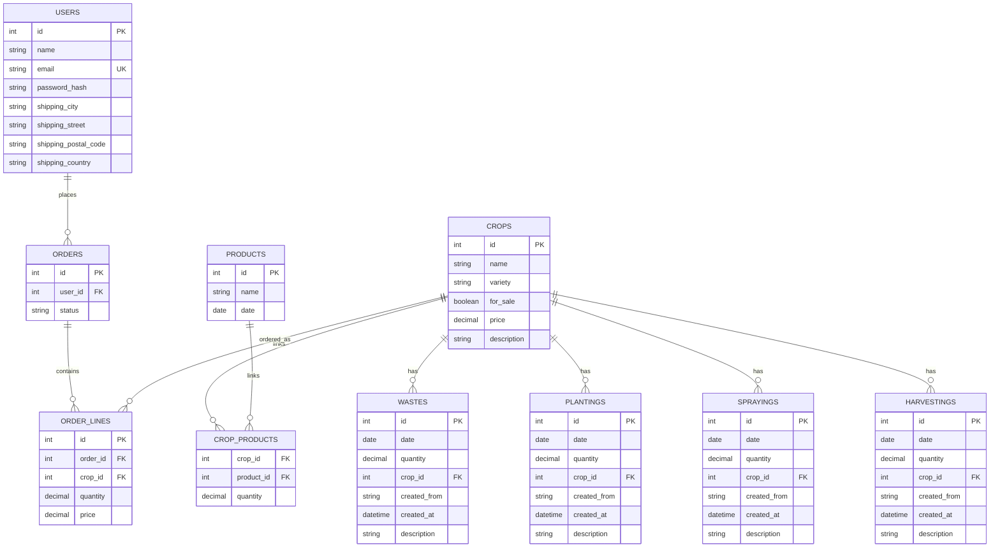

# DB Scheme

This document defines the relational schema for the Home Farm application.

## Overview

The schema models:
- users and their shipping addresses
- crops and crop activity records
- products made from crops
- customer orders and order lines

## Relationships

## Tables

### users

Stores registered users.

| Column | Type | Notes |
| --- | --- | --- |
| id | int | Primary key |
| name | string | User full name |
| email | string | Unique login email |
| password_hash | string | Hashed password |
| shipping_city | string | Part of shipping address |
| shipping_street | string | Part of shipping address |
| shipping_postal_code | string | Optional address detail |
| shipping_country | string | Optional address detail |

### crops

Stores farm crops and whether they can be sold directly.

| Column | Type | Notes |
| --- | --- | --- |
| id | int | Primary key |
| name | string | Crop name |
| variety | string | Crop variety |
| for_sale | boolean | Whether the crop is available for sale |
| price | decimal | Unit price |
| description | string | Optional notes |

### wastes

Stores waste/spoilage records for crops.

| Column | Type | Notes |
| --- | --- | --- |
| id | int | Primary key |
| date | date | Waste date |
| quantity | decimal | Quantity wasted |
| crop_id | int | FK to crops.id |
| created_from | string | Source of the record |
| created_at | datetime | When the record was created |
| description | string | Optional notes |

### plantings

Stores planting records.

| Column | Type | Notes |
| --- | --- | --- |
| id | int | Primary key |
| date | date | Planting date |
| quantity | decimal | Quantity planted |
| crop_id | int | FK to crops.id |
| created_from | string | Source of the record |
| created_at | datetime | When the record was created |
| description | string | Optional notes |

### sprayings

Stores spraying records.

| Column | Type | Notes |
| --- | --- | --- |
| id | int | Primary key |
| date | date | Spraying date |
| quantity | decimal | Quantity used |
| crop_id | int | FK to crops.id |
| created_from | string | Source of the record |
| created_at | datetime | When the record was created |
| description | string | Optional notes |

### harvestings

Stores harvesting records.

| Column | Type | Notes |
| --- | --- | --- |
| id | int | Primary key |
| date | date | Harvesting date |
| quantity | decimal | Quantity harvested |
| crop_id | int | FK to crops.id |
| created_from | string | Source of the record |
| created_at | datetime | When the record was created |
| description | string | Optional notes |

### products

Stores processed products made from crops.

| Column | Type | Notes |
| --- | --- | --- |
| id | int | Primary key |
| name | string | Product name |
| date | date | Product date |

### crop_products

Join table between crops and products.

| Column | Type | Notes |
| --- | --- | --- |
| crop_id | int | FK to crops.id |
| product_id | int | FK to products.id |
| quantity | decimal | Amount of crop used in the product |

### orders

Stores customer orders.

| Column | Type | Notes |
| --- | --- | --- |
| id | int | Primary key |
| user_id | int | FK to users.id |
| status | string | Order status |

### order_lines

Stores items inside an order.

| Column | Type | Notes |
| --- | --- | --- |
| id | int | Primary key |
| order_id | int | FK to orders.id |
| crop_id | int | FK to crops.id |
| quantity | decimal | Ordered quantity |
| price | decimal | Unit price at order time |

## Notes

- The `shipping_adress` concept is represented as flattened columns under `users.shipping_*`.
- The repeated `created_from` and `created_at` fields are kept in activity tables to preserve the source and audit trail of each record.
- `order_lines.price` should store the price at the time the order was created so later crop price changes do not affect past orders.